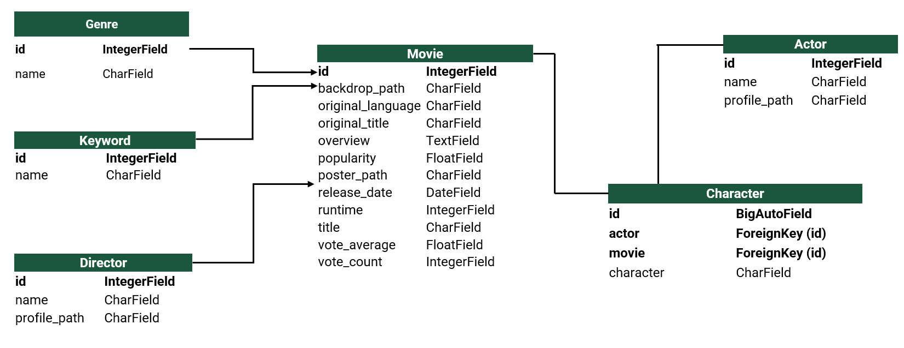
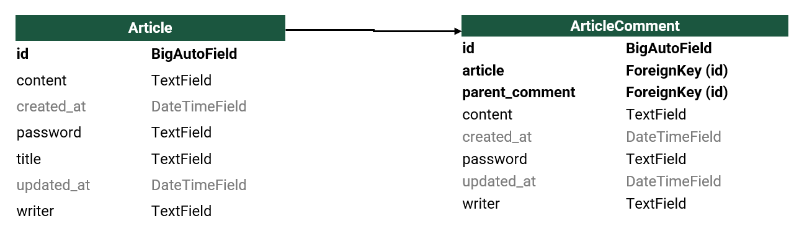
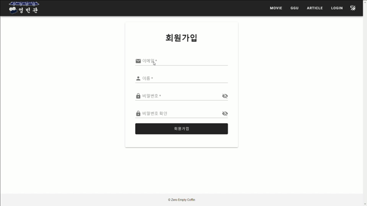
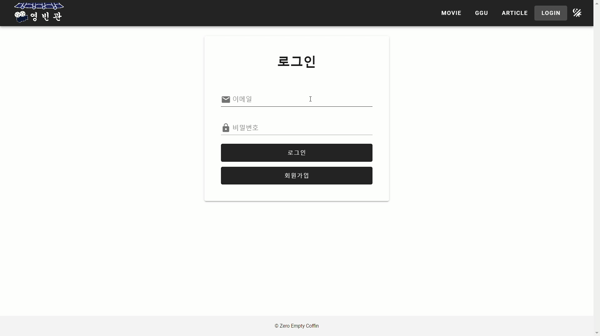
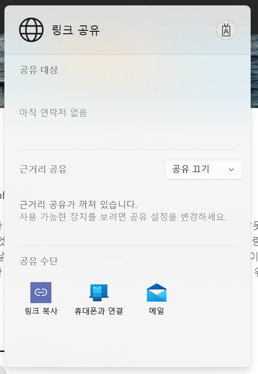
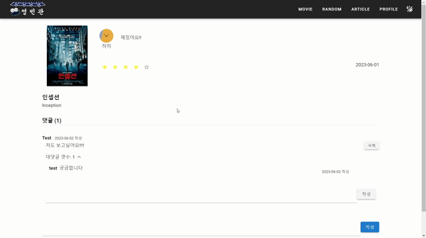
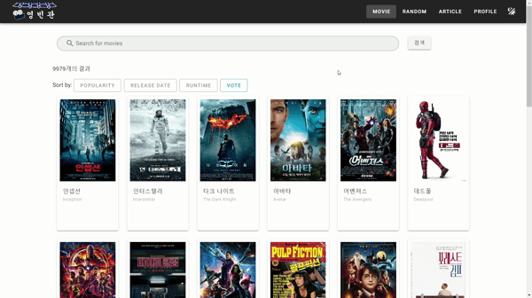
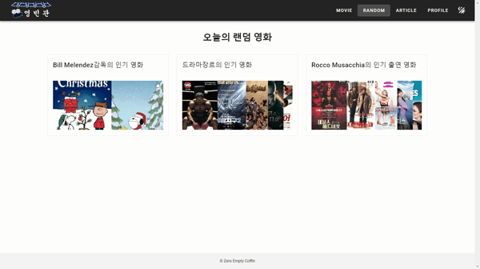
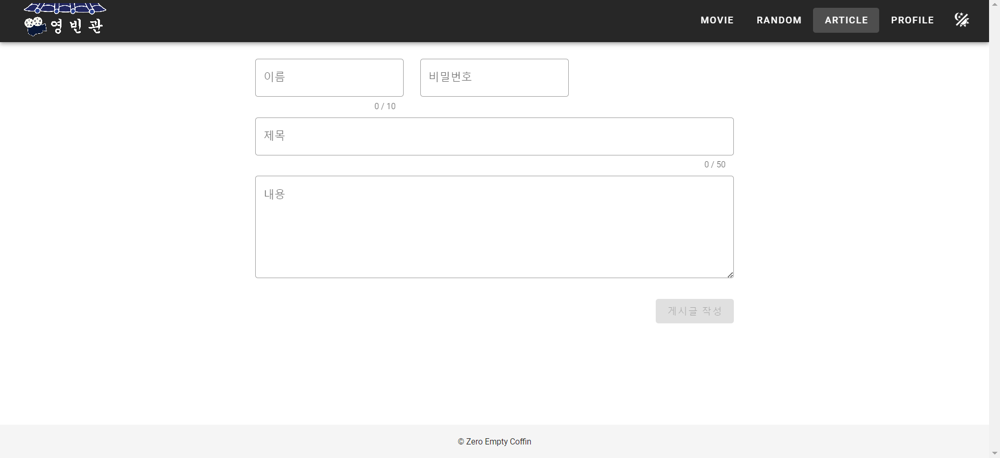
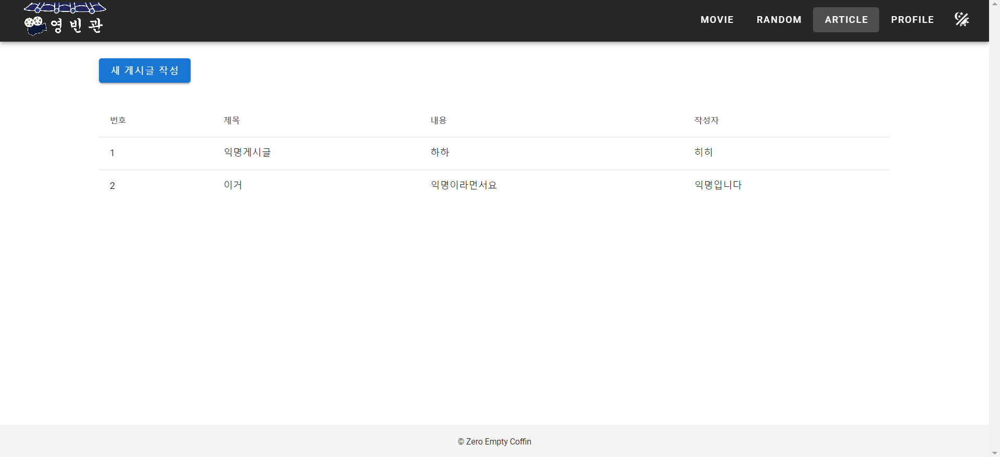

# 영빈관

## 프로젝트 개요

- 영화에 대한 기록을 원하는 사람을 대상으로 영화 추천 및 리뷰 작성 사이트 구현

- TMDB API를 활용하여 영화 데이터를 수집하여 데이터베이스에 저장

- 영화 추천의 경우 사용자가 검색한 영화를 특정 조건에 맞춰 정렬하는 방식과 랜덤 감독의 영화를 추천하는 방식으로 설계

## 서버 실행

### back-server

```bash
$ cd back-server/
```

```bash
$ py -m venv venv
$ source venv/Scripts/activate
$ pip install -r requirements.txt
```

```bash
$ py manage.py migrate
$ py manage.py loaddata movie.json
$ py manage.py runserver
```

### front-server

```bash
$ cd front-server/
```

```bash
$ npm i
$ npm run serve
```

### 프로젝트 기간

2023.05.17 - 2023.05.25 (9일)

### 기술 스택

<strong>Back</strong>

   

<strong>Front</strong>

   

## 팀원 정보 및 업무 분담 내역

- 구희영: 영화 데이터 수집, 영화 검색 및 추천 알고리즘 개발, Vue 클라이언트 구현

- 김현빈: DRF 설계 (JWT를 이용한 회원관리, 영화 리뷰 CRUD 등), 익명 게시판 구현

## 목표 서비스 및 실제 구현 정도

- 유저

  JWT Token으로 유저 관리(로그인, 로그아웃, 회원가입)

  ~~소셜 로그인~~: *Postman으로는 확인 했으나, 요청 경로 및 Axios 문제로 넣지 않음*

  유저 간 팔로우/팔로워 및 프로필 조회 기능

  ~~관리자의 영화 정보 생성/수정/삭제 및 페이지 관리 기능~~

- 영화 조회

  pagenation을 이용해 영화 전체 조회

  영화 제목, 원제목 검색

  ~~영화 장르, 출연 배우, 키워드 검색~~

  영화 데이터(인기도, 상영시간, 개봉일)를 기준으로 오름차순/내림차순 정렬

- 영화 상세 조회

  영화에 대한 좋아요 표시 기능

  리뷰 작성(본 날짜, 코멘트, 별점)

- 리뷰 

  본인이 작성한 리뷰에 대해 수정 및 삭제 가능

  리뷰에 대한 댓글 및 대댓글 작성 기능 구현

- 프로필

  프로필이미지: [Boring Avatars-Beam](https://github.com/boringdesigners/boring-avatars-service), 유저 이름을 사용해 고유 아바타 생성

  유저 간 팔로우 기능 구현 및 팔로우/팔로워 조회

  작성한 리뷰 조회 기능 (전체 조회, 날짜 별 조회)

- 익명 게시판

  게시글/댓글 작성 시 익명 이름과 비밀번호를 입력받아 게시글 작성

  작성 시 입력한 이름과 비밀번호와 동일한 경우 게시글/댓글 수정 ~~및 삭제~~ 가능

## ERD







## 영화 추천 알고리즘에 대한 기술적 설명

- 검색된 영화 정렬

  1. 검색
  
  django_filters로 영화 제목, 원 제목에 대한 검색 기능 구현

  공백 없는 입력 처리로 띄어쓰기에 관계 없이 데이터 검색

  > 검색 URL params
  >
  > search=영화제목/원제목
  >
  > 생략 시 전체 데이터 조회
  >
  > ordering=정렬필터_오름차순/내림차순
  >
  > `ordering=popularity_desc`

  > 기타 데이터 검색 params(미사용)
  >
  > director=감독이름, actor=배우이름, character=캐릭터이름, genre=장르이름
  >
  > 두 정보 함께 검색 가능 `director=감독이름&genre=장르이름`

  2. 정렬

  검색된 데이터의 인기도(Popularity), 상영시간(Runtime), 개봉일(Released)을 기준으로 오름차순/내림차순 정렬

  queryset으로 필터와 조건을 입력받아 django ORM의 order_by를 활용해 정렬된 데이터 제공

  추가적으로 대중화된 정보를 추천하기 위해 평점 갯수(vote_count)를 기준으로 내림차순 정렬 후, 평점(vote_average) 순으로 정렬된 데이터 제공

- 랜덤 감독 영화 추천

  수집한 감독 데이터 중 랜덤한 감독 1명을 골라, 그 감독의 모든 영화 정보 제공

## 실행 화면

### 회원가입

- 회원가입 유효성 검사
  
  이메일 유형 검사, 이메일/이름 중복체크, 비밀번호 표시

- 입력 칸 전체 삭제 가능

  

### 로그인

- 등록된 이메일 여부 확인

  

### 영화 검색

- 띄어쓰기에 관계없이 동일한 검색 결과 제공

- 한글 제목, 원 제목 검색

- 검색 결과 갯수 제공

  

- 필터로 영화 정렬 (오름차순/내림차순)

  

### 영화 상세 페이지

- 해당 영화에 대한 정보 제공

- 영화에 대한 좋아요, 공유 링크복사 기능

  

  

### 영화 리뷰 작성

- 영화 상세 페이지에서 v-dialog를 사용해 빠른 리뷰 작성 가능

- 영화를 본 날짜, 평점, 영화에 대한 리뷰 기록

  

### 리뷰 상세 페이지

- 리뷰 클릭 시 상세 페이지로 이동

- 내가 쓴 리뷰만 수정 및 삭제가 가능

  

- 리뷰에 대한 댓글 작성 및 삭제

- 대댓글 작성 및 숨기기 기능

  

### 프로필

- 리뷰 상세 페이지에서 작성자 클릭 시 해당 유저의 프로필 페이지로 이동

- 해당 유저 팔로우/언팔로우 및 유저의 리뷰, 팔로워 및 팔로잉 확인 가능

  

- 상단 앱 바의 `PROFILE` 클릭 시 프로필 페이지로 이동

- 작성한 전체 리뷰와 날짜 별 리뷰 조회

  

## 랜덤 추천

- 랜덤한 감독의 영화 1개 이상 추천

  

## 익명 게시판

- 익명 이름, 비밀번호 입력 후 게시글 작성

  

  

### 추가 기능

- Scroll to Top
  
  스크롤을 내리면 맨 위로 가는 버튼 표시

  

- Dark/Light Toggle
  
  탭 이동 시에도 테마 유지

  

## 후기

  - Keep

    매일 수행한 작업 기록하기

    새로운 기능 찾아보고 적용하기

  - Problem

    초반 기획의 부실함 -> 프로젝트 준비 기간이 오래 걸렸고, 예상에서 벗어난 결과가 많았다.

    csv 파일 변환 방법 -> 원하는 데이터가 나올 때 까지 새로운 csv 파일을 만들어 냄
  
  - TRY

    기획 단계를 탄탄하게 설계하기 

    csv 파일 수정을 통해 데이터 처리 효율 높이기

    콘솔 로그 에러를 잡아 완성도 높이기
